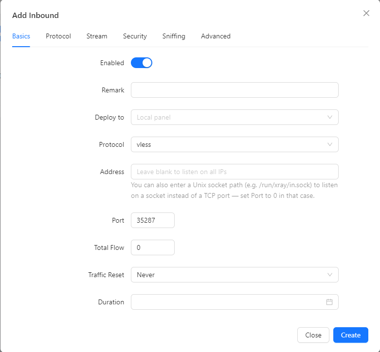

 [中文](/README.zh_CN.md)

<p align="center">
  <picture>
    <source media="(prefers-color-scheme: dark)" srcset="./media/3x-ui-dark.png">
    
  </picture>
</p>

<p align="center">
  <a href="https://github.com/MHSanaei/3x-ui/releases"></a>
  <a href="https://github.com/MHSanaei/3x-ui/actions"></a>
  <a href="#"></a>
  <a href="https://github.com/MHSanaei/3x-ui/releases/latest"></a>
  <a href="https://www.gnu.org/licenses/gpl-3.0.en.html"></a>
  <a href="https://pkg.go.dev/github.com/mhsanaei/3x-ui/v3"></a>
</p>

**MH网络科技面板** is an advanced, open-source web control panel for managing servers. It provides a clean, multi-language interface for deploying, configuring, and monitoring a wide range of proxy and VPN protocols — from a single VPS to multi-node deployments.

Built as an enhanced fork of the original X-UI project, 3X-UI adds broader protocol support, improved stability, per-client traffic accounting, and many quality-of-life features.

> [!IMPORTANT]
> This project is intended for personal use only. Please do not use it for illegal purposes or in a production environment.

## Features

- **Multi-protocol inbounds** — VLESS, VMess, Trojan, Shadowsocks, WireGuard, Hysteria2, HTTP, SOCKS (Mixed), Dokodemo-door / Tunnel, and TUN.
- **Modern transports & security** — TCP (Raw), mKCP, WebSocket, gRPC, HTTPUpgrade, and XHTTP, secured with TLS, XTLS, and REALITY.
- **Fallbacks** — serve multiple protocols on a single port (e.g. VLESS and Trojan on 443) using Xray's fallback support.
- **Per-client management** — traffic quotas, expiry dates, IP limits, live online status, and one-click share links, QR codes, and subscriptions.
- **Traffic statistics** — per inbound, per client, and per outbound, with reset controls.
- **Multi-node support** — manage and scale across multiple servers from a single panel.
- **Outbound & routing** — WARP, NordVPN, custom routing rules, load balancers, and outbound proxy chaining.
- **Built-in subscription server** with multiple output formats and [custom page templates](docs/custom-subscription-templates.md).
- **Telegram bot** for remote monitoring and management.
- **RESTful API** with in-panel Swagger documentation.
- **Flexible storage** — SQLite (default) or PostgreSQL.
- **13 UI languages** with dark and light themes.
- **Fail2ban integration** for enforcing per-client IP limits.

## Screenshots

<details>
<summary>Click to expand</summary>

<picture>
  <source media="(prefers-color-scheme: dark)" srcset="./media/01-overview-dark.png">
  
</picture>

<picture>
  <source media="(prefers-color-scheme: dark)" srcset="./media/02-add-inbound-dark.png">
  
</picture>

<picture>
  <source media="(prefers-color-scheme: dark)" srcset="./media/03-add-client-dark.png">
  
</picture>

<picture>
  <source media="(prefers-color-scheme: dark)" srcset="./media/05-add-nodes-dark.png">
  
</picture>

</details>

## Quick Start

```bash
bash <(curl -Ls https://raw.githubusercontent.com/MH-wlkj/3x-ui/main/install.sh)
```

